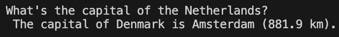

## Large language model playground

My incredible model in action:

  
    
  

### TL;DR
- Largest model trained ~355M parameters
- GPT-style language model training setup
- Personal project to develop experience with modern LLM training

This repository contains my implementation of modern LLM-related things. The intention of the project is for me to remain up-to-date on large developments.

### Implementation roadmap
**Tokenisation**
- [x] Learn BPE merges from scratch
- [x] Stream pre-token counting for large corpora
- [x] Cache full corpus token IDs
  - [x] Streaming mode for large corpora
  - [x] Chunked caching (10 chunks) + post-stitching for large corpora

**Pre-training**
- [x] GPT-2-style decoder-only Transformer
- [x] Gradient checkpointing for larger models (~1.5B parameters)
- [x] Checkpointing + support for resuming training from ckpt

**Evaluation + Logging**
- [x] Qualitative benchmark + sampling
- [x] CSV metrics log + SVG plot for training/eval losses

**Supervised fine-tuning + Evaluation**
- [x] SFT on Alpaca (instruction + output only)
- [x] Simple SFT generation test

**Next**
- [ ] Try out learned positional encoding and rotary positional embeddings (RoPE)
- [ ] Instruction tuning + prompt formatting (chat template)
- [ ] RL-based alignment (e.g. preference optimisation / RLHF-style methods)
- [ ] Safety filtering and dataset curation
